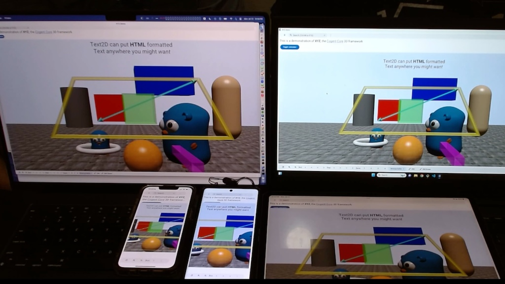
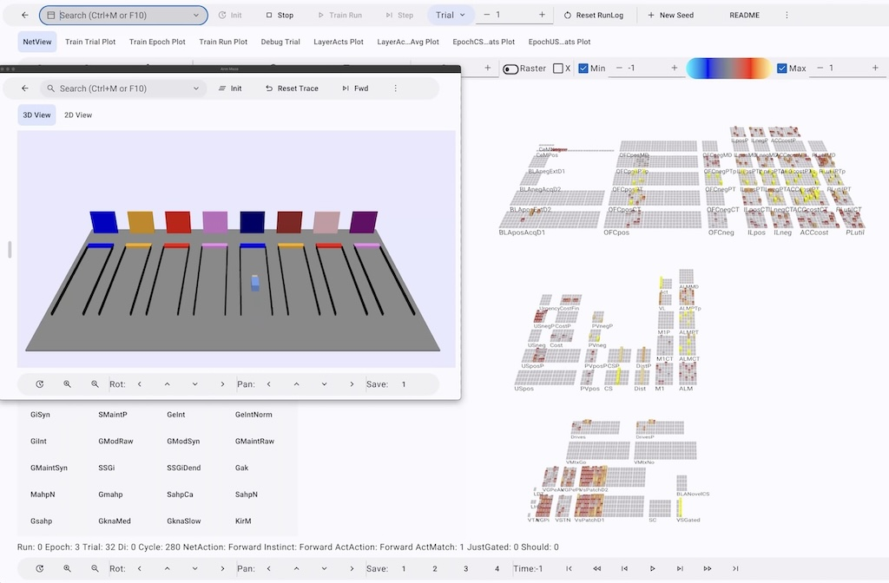
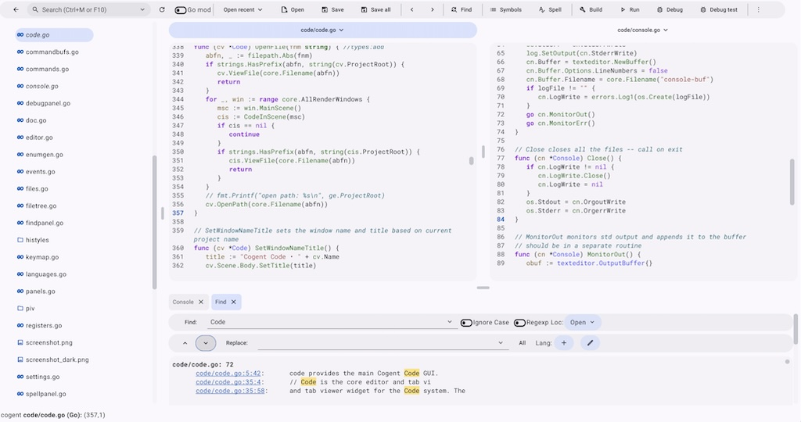
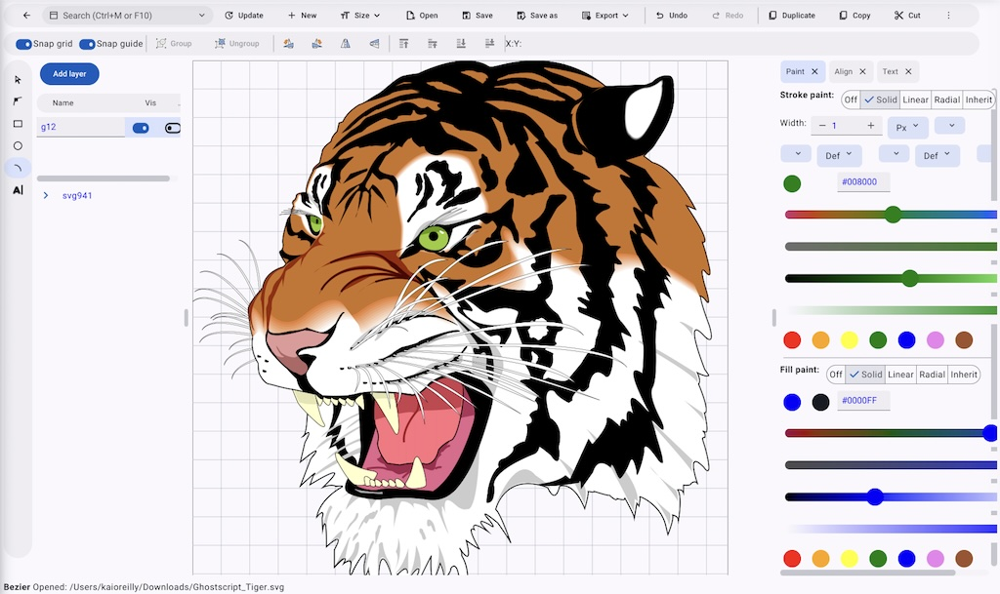

+++
author = ["Kai O'Reilly", "Randy O'Reilly"]
+++

*For a video introduction to Cogent Core, see https://youtu.be/nZzdy3Kyypk*

Today we are announcing the initial public release of the Cogent Core GUI framework. Cogent Core allows you to build powerful, fast, elegant apps that run on all platforms with a single Go codebase, allowing you to Code Once, Run Everywhere (Core). This blog is an interactive Cogent Core app running on the web using [wasm](https://en.wikipedia.org/wiki/WebAssembly). The same code can run on macOS, Windows, Linux, iOS, Android, and the web through a command line tool that manages all the details for running and building apps for each platform.



*The same Cogent Core app running on many devices using the same code*

Cogent Core is written in [Go](https://go.dev) and inherits many features from this language and its associated ecosystem. Go code is simple and easy to read and write, and it emphasizes a minimalist approach without the extra syntax and boilerplate that clutters other languages.

Here's a simple hello world app in Cogent Core:

```Go
package main

import "cogentcore.org/core/core"

func main() {
    b := core.NewBody()
    core.NewButton(b).SetText("Hello, World!")
    b.RunMainWindow()
}
```

See that "Hello, World!" button? That is a live rendering of the code shown in the text editor above. You can change the message in the code, press `Ctrl+Enter` or just click off, and you'll see it update!

Cogent Core supports all the usual types of GUI widgets, along with some fairly advanced ones not found in other frameworks. Interactive, editable examples of all major widgets are available on the main [docs](https://www.cogentcore.org/core) page (which is also a Cogent Core app running via wasm).

Here's a small sample of widgets, and a few things you can do with them:

```Go
core.NewButton(b).SetText("Send").SetIcon(icons.Send).OnClick(func(e events.Event) {
    core.MessageSnackbar(b, "Message sent")
})
core.NewText(b).SetText("Name:").SetTooltip("Enter your name in the text field")
core.NewTextField(b).SetPlaceholder("Jane Doe")
value := 0.5
spinner := core.Bind(&value, core.NewSpinner(b))
slider := core.Bind(&value, core.NewSlider(b))
spinner.OnChange(func(e events.Event) {
    slider.Update()
})
slider.OnChange(func(e events.Event) {
    spinner.Update()
})
core.NewColorButton(b).SetColor(colors.Orange)
type language struct {
    Name   string
    Rating int
}
sl := []language{{"Go", 10}, {"Python", 5}}
core.NewTable(b).SetSlice(&sl).OnChange(func(e events.Event) {
    core.MessageSnackbar(b, fmt.Sprintf("Languages: %v", sl))
})
```

Again, you can modify any of the code above and immediately see the effects!

You can even make interactive plots of data:

```Go
type Data struct {
	Time   float32
	Users  float32
	Profit float32
}
plotcore.NewPlotEditor(b).SetSlice([]Data{
    {0, 500, 1520},
    {1, 800, 860},
    {2, 1600, 930},
    {3, 1400, 682},
})
```

## Key features

The key feature of Cogent Core is that it allows you to efficiently write full-scale GUI apps in Go, with greater power and elegance than other frameworks. Specifically:

* It provides a full set of GUI widgets, with built-in support for most elements of the [Material 3](https://m3.material.io) standard, with tooltips, drag-and-drop, sprites, popup completion, a full text editor with code highlighting, and other advanced features, allowing powerful apps to be assembled by customizing these existing elements.

* Extensive styling properties allow everything to be customized, including a powerful automatic layout system that solves all the hard layout problems for you, and complete event-driven control over app behavior. Styling is easy to control and well documented, and anyone can quickly customize widgets to fit their needs.

* Responsive widget elements automatically adapt to different screen sizes and orientations, enabling one coherent codebase to run across different platforms.

* The code to implement standard widgets is transparent and elegant, making it easy to write your own custom widget elements if needed.

* A dynamic color system based on Material Design 3 enables effortless switching between light and dark mode and gives developers and users the ability to easily customize the colors of an app while maintaining key contrast and legibility standards:

<color-scheme-control></color-scheme-control>

* Automatic views of any Go data structure, including slices, structs, and maps, allow for instant data binding and advanced app inspection, making complex widgets like editable tables, trees, and forms take just one line of code.

* [SVG](https://cogentcore.org/core/widgets/media/svg), [HTML](https://cogentcore.org/core/widgets/other/html), [Markdown](https://cogentcore.org/core/widgets/other/html), [Canvas](https://cogentcore.org/core/widgets/media/canvases), [Video](https://www.cogentcore.org/core/widgets/media/videos), and [3D](https://www.cogentcore.org/core/widgets/other/xyz) support make it possible to create engaging multimedia experiences from 3D models to games, and documentation and blogs like you're reading now.


*Screenshot of Cogent Core 3D Demo*

* [Plans](https://cogentcore.org/core/basics/plans) provide an efficient mechanism for dynamically updating content in a way that captures the best of imperative and declarative GUI paradigms.

* A focus on keyboard navigation and user customization enables streamlined access to important functionality with any keybindings, with a dynamic search bar giving convenient access to all app actions on every platform.

* [Vulkan](https://en.wikipedia.org/wiki/Vulkan), a modern, cross-platform, high-performance graphics framework, allows apps to run on all platforms at extremely fast speeds. All Cogent Core apps compile to machine code, allowing them to run without any overhead.

* Cogent Core is completely free and open source under the permissive [BSD-3 License](https://github.com/cogentcore/core/blob/main/LICENSE), allowing you to use it for any purpose, commercially or personally. We believe that software works best when everyone can use it.

## Our story

We are committed to supporting Cogent Core and growing a full software ecosystem around it, building on where Cogent Core came from and where we want it to go.

The initial version of this software was named [GoKi](https://github.com/goki/gi). It was written in 2018 by Professor Randy O'Reilly to enable him to develop advanced [neural network models](https://emersim.org) of the brain using Go, instead of C++. He had grown frustrated with the long build times and tiresome boilerplate involved in coding in C++. At that time, Python was becoming increasingly popular, but it is really just a wrapper around C++, resulting in a complex and unpleasant combination of two languages. Go, by contrast, compiles nearly instantly, and runs nearly as fast as C++, providing a clean one-language solution. The small difference in compute time (less than 5-10%) was more than made up for by the massive increase in coding efficiency and overall happiness from using Go.

The only thing missing from the Go ecosystem at the time was a full-featured native GUI framework, so Randy built on his experience with [Qt](https://en.wikipedia.org/wiki/Qt_(software)) to write one in Go. GoKi provided a powerful 2D and 3D interface that enabled experts, as well as undergraduate and graduate students in classes taught by professors around the world, to better understand and develop new ideas about how the brain works. However, as a first effort in Go, GoKi retained too much of the C++ style.



*Screenshot of a neural network model built with Cogent Core*

Meanwhile, Randy's son Kai was busy experimenting with different frameworks and languages for various coding projects. He eventually came to the same conclusion that Go is truly the best language around. After exploring existing GUI frameworks in Go, Kai decided that a major overhaul of GoKi might produce a better framework than any of the other options.

So the father and son team (more son than father, to be clear) spent the next year rewriting this codebase many times over, peeling away layers of complexity and finding the most robust and elegant solutions to the many problems such a framework must solve. The [principles](https://cogentcore.org/core/architecture/principles) capture some of our hard-won lessons. We hope that the experience of using this framework demonstrates the resulting simplicity and power of the approach.

Throughout this process, Randy maintained what is now [Cogent Code](https://cogentcore.org/cogent/code) as his primary everyday code editor, and students and colleagues explored and extended the neural network models based on this framework. Therefore, the core of the framework is well-tested and ready to use, even as we continue to build out more features and welcome input from the broader community for how to make it even better.



*Screenshot of Cogent Code*

We each have a long-term commitment to the future of the Cogent Core framework. Randy and other scientists and instructors rely on it for research and teaching. Kai plans to build his career around the framework. He is programming apps in it and is available for consulting projects to develop Cogent Core solutions.

We think Go is such a special language that it deserves to be used for everything and anything, far beyond its traditional role as a server-side and cli-based workhorse. We hope that the excitement of building toward a world-class GUI framework in our beloved Go language will grow a vibrant community of users and developers.

## Future directions

One important future direction, highlighted by the interactive editing ability shown above, is to use the [yaegi](https://github.com/traefik/yaegi) Go interpreter as a replacement for languages like Python so that you can transparently have a dynamic, interpreted experience as well as the lightning-fast compilation of Go. We think this can provide an ideal combination of rapid prototyping and hot-reloading (as in the Flutter framework), within a strongly typed and robust language that scales to large-scale applications (unlike Python and JavaScript).

In addition, we will continue working on a shell language variant of Go, called `cosh` or [Cogent Shell](https://github.com/cogentcore/core/tree/main/shell), which allows direct intermixing of shell-like execution of command-line tools with standard Go code using yaegi. Everything can be transpiled into standard Go and built the usual way as a fully compiled executable as well. Next, we plan to extend this general approach to the numerical computing and data science domain, in the [Cogent Numbers](https://github.com/cogentcore/cogent/tree/main/numbers) framework, to provide a viable competitor in this Python-dominated space.

We will also be completing the [Cogent Canvas](https://cogentcore.org/cogent/canvas) app for editing SVG vector graphics, the [Cogent Mail](https://github.com/cogentcore/cogent/tree/main/mail) client, a [terminal emulator](https://github.com/cogentcore/cogent/tree/main/terminal), and a [3D modeling app](https://github.com/cogentcore/cogent/tree/main/craft). We also plan to make a video editor and continue working on a [web browser](https://github.com/cogentcore/cogent/tree/main/web).



*Screenshot of Cogent Canvas*

We will also prioritize implementing internationalization and accessibility for the next major release of Cogent Core.

## Comparisons with other frameworks

In the remainder of this blog, we provide some commentary about how we think Cogent Core compares with other widely used GUI frameworks. 

### Web frameworks

Most of the world's GUI software is written using one of the many web frameworks, which provide various benefits but come with challenges:

* The awkward separation of JS, HTML, and CSS makes it hard to create dynamic interfaces without some combination of them, resulting in inconsistent languages like [JSX](https://en.wikipedia.org/wiki/JSX_(JavaScript)) and [SCSS](https://en.wikipedia.org/wiki/Sass_(style_sheet_language)). Cogent Core allows you to write everything in one coherent language.

* HTML and CSS don’t provide modern-looking widgets out of the box, forcing you to either [wrestle with CSS](https://blog.logrocket.com/creating-custom-css-range-slider-javascript-upgrades/) or depend on one of many inconsistent CSS frameworks. Cogent Core comes with modern and easily customizable widgets without a single line of CSS.

* Web frameworks are plagued by browser inconsistencies, making things as simple as favicons the subject of [blog posts](https://dev.to/masakudamatsu/favicon-nightmare-how-to-maintain-sanity-3al7) featuring language like “nightmare” and “how to maintain sanity.” Cogent Core apps automatically work consistently across all devices.

The benefits of Cogent Core relative to the web are highlighted by our [tic-tac-toe tutorial](https://www.cogentcore.org/core/tutorials/tic-tac-toe), which has fewer than half the lines of code of the [React one](https://react.dev/learn/tutorial-tic-tac-toe), while also containing no ternaries and no JSX.

### Flutter

Although [Flutter](https://flutter.dev) can be good for creating simple mobile apps, it has several limitations:

* It is not suitable for building advanced desktop apps, such as those that [need multiple windows](https://github.com/flutter/flutter/issues/30701). Cogent Core has complete desktop support, as evidenced by the powerful multi-window [code editor](https://cogentcore.org/cogent/code) and [neural network models](https://emersim.org) built with it.

* Flutter’s declarative paradigm creates excessive indentation and makes it hard to integrate logic into GUIs without falling back on ternaries and other such constructs. For example, here is an indentation closing block from the [Flutter sample app](https://github.com/flutter/samples/blob/main/material_3_demo/lib/home.dart):

```dart
                        ),
                      ),
                    ),
                  ),
                ),
              ),
            ),
          ),
        ),
      ),
    );
  }
}
```

Cogent Core uses [plans](https://cogentcore.org/core/basics/plans) to allow for elegant integration of imperative and declarative logic.

* Flutter contains a lot of repetitive boilerplate, such as `Widget build(BuildContext context)`, and is peppered with distracting keywords like `final`, `required`, and `@override`. Cogent Core works to avoid boilerplate and contains few keywords due to Go’s emphasis on simplicity.

### Platform-specific frameworks

Many apps are written using languages specific to certain platforms, such as Swift and Java. However, doing this requires significant duplication of effort as you have to write and maintain your app multiple times if you want it to be cross-platform. Cogent Core allows you to write an app in one language and have it work well on all platforms.

### Other Go frameworks

* [Fyne](https://fyne.io) is "fine" overall, but it does not provide the customization and advanced widgets necessary for building powerful apps. Cogent Core enables complete customization and provides a vast array of useful widgets.

* [Gio](https://gioui.org) has a lot of powerful features, but the low-level nature of the immediate mode design makes it difficult to develop apps since even simple things like making a button with text and an icon can take [30 lines of code](https://git.sr.ht/~eliasnaur/gio-example/tree/main/kitchen/kitchen.go#L225). In Cogent Core, it only takes one line of code to make a button with text and an icon.

* [Wails](https://wails.io), [go-app](https://go-app.dev), and other such packages suffer many of the same issues as standard web frameworks, as you are still effectively writing JS, HTML, and CSS. Cogent Core allows you to completely bypass web languages and write everything in Go.

## Conclusion

Cogent Core brings the power and elegance of the Go programming language to the GUI domain, opening up a whole new world of powerful and exciting applications. As you can see from our interactive [documentation](https://www.cogentcore.org/core) and [videos](https://youtube.com/@CogentCore), once you master a core set of basic concepts, there is no limit to what you can create, with remarkable ease and elegance.
